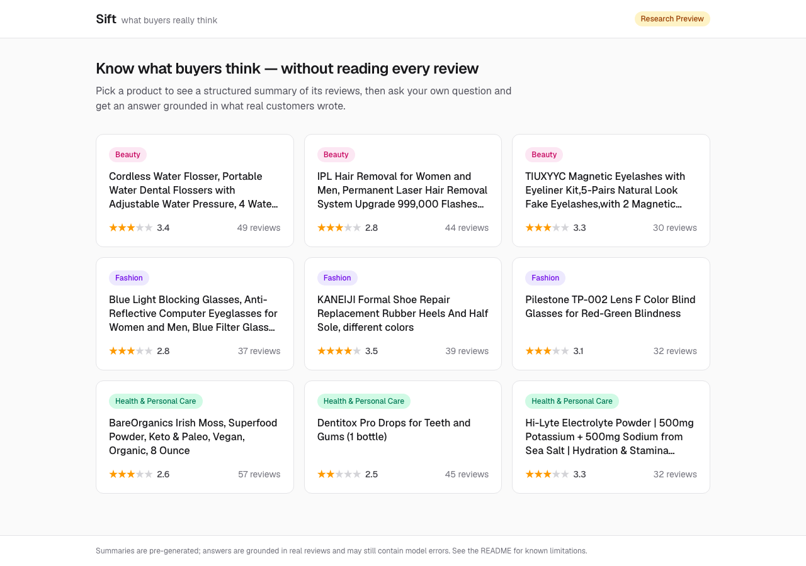
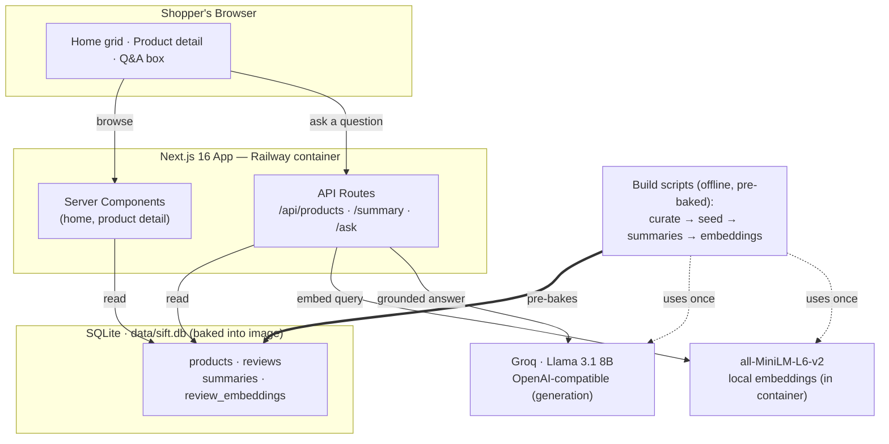
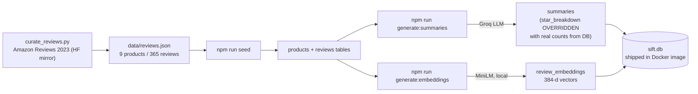
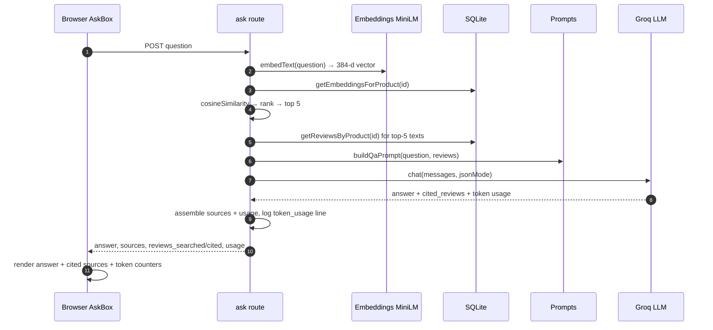

# Sift

**Sift turns 30–60 customer reviews per product into a structured summary you can
trust, and answers your specific questions grounded only in what real reviewers
wrote.** Instead of scrolling reviews, you see the aspects people actually discuss
(with real quotes), an honest star breakdown, and a Q&A box that cites its sources.

**Live demo:** https://sift-mvp-production.up.railway.app



> ⚠️ **Research Preview.** This is a week-1 build that deliberately surfaces where a
> small model (Llama 3.1 8B) succeeds and fails. See [What works / what doesn't](#what-works--what-doesnt).

## What it does

- **Structured summaries** (pre-generated): overall sentiment, a star-rating
  breakdown, ranked aspects with a representative quote each, and a prose summary.
- **Grounded Q&A** (real-time RAG): ask anything; the answer comes only from the
  product's reviews, with the specific reviews cited and a relevance score.
- **9 curated products** across Beauty, Fashion, and Health & Personal Care
  (365 real Amazon reviews).

## Tech stack

Next.js 16 (App Router) · SQLite (better-sqlite3) · Llama 3.1 8B via Groq
(OpenAI-compatible) · local embeddings via `@huggingface/transformers`
(all-MiniLM-L6-v2). Everything lives in one SQLite file; no external database.

## Architecture

**Core idea:** summaries and review embeddings are **pre-baked at build time** into a
single SQLite file that ships inside the container. Browsing is therefore pure
database reads (fast, free). Only the **Q&A** path makes a live LLM call.

> The diagrams below render natively on GitHub. Static PNG fallbacks:
> [HLD](docs/screenshots/architecture-hld.png) ·
> [build pipeline](docs/screenshots/architecture-lld-build.png) ·
> [Q&A sequence](docs/screenshots/architecture-lld-qa-sequence.png).

### High-level design (HLD)



### Low-level design (LLD)

**1. Build pipeline — how `sift.db` is produced** (run once, offline):



**2. Runtime — the RAG Q&A request** (`POST /api/products/[id]/ask`):



**Browse path** (no LLM): `GET /` → `getAllProducts()` and
`GET /products/[id]` → `getProductById()` + `getSummary()`, both rendered by Server
Components reading SQLite directly.

## Run it locally

**Prerequisites:** Node 20+ and a Groq API key (free at
[console.groq.com](https://console.groq.com/keys)).

```bash
# 1. Install
npm install

# 2. Configure — copy the example and add your key
cp .env.example .env.local
#   then edit .env.local: set LLM_API_KEY=gsk_...

# 3. Build the database (seed reviews → summaries → embeddings)
npm run seed                 # loads data/reviews.json into SQLite
npm run generate:summaries   # pre-bakes summaries (needs LLM_API_KEY)
npm run generate:embeddings  # embeds every review (downloads ~25MB model once)

# 4. Run
npm run dev                  # http://localhost:3000
```

> The repo already ships `data/sift.db` with summaries + embeddings baked in, so you
> can skip step 3 and go straight to `npm run dev` to try it. Re-run step 3 only if
> you change the data or prompts.

**Validate everything** (data integrity + all 5 evals across categories):

```bash
npm run validate             # 26 checks; see docs/eval-results.md
```

## Use a different LLM provider

The client is coded against the standard `/v1/chat/completions` API. Swap providers by
changing **three env vars only** — no code changes:

```bash
# Groq (default)
LLM_BASE_URL=https://api.groq.com/openai/v1
LLM_API_KEY=gsk_...
LLM_MODEL=llama-3.1-8b-instant

# e.g. Together, OpenAI, or local Ollama (http://localhost:11434/v1)
```

Embeddings always run locally (`@huggingface/transformers`), so they need no API key.

## Deploy (Railway)

A `Dockerfile` is included. It ships `data/sift.db` (with baked summaries +
embeddings) and pre-caches the embedding model into the image.

1. Create a Railway service from this repo (it auto-detects the Dockerfile).
2. **Set these Variables in the Railway service** (or the Q&A endpoint 500s):
   `LLM_BASE_URL`, `LLM_API_KEY`, `LLM_MODEL`. Railway injects `PORT` automatically.
3. Deploy. Verify the product list, a summary, and a Q&A all work on the public URL.

**Token observability.** Each Q&A shows its token usage in the UI (per-answer + a
running session total) and logs a structured line to stdout that Railway captures:
`[token_usage] {"op":"qa","product_id":"…","total_tokens":953,…}`. Search
`token_usage` in the Railway service logs to audit or troubleshoot high-usage
operations.

## What works / what doesn't

**Works well:**
- Quotes are real (Eval 1) — copied verbatim from reviews and verified.
- Aspect extraction (Eval 2) — the dominant aspect lands in the top 2.
- Star math (Eval 3) — exact, because we **compute it from the database** rather than
  trust the model (see below).
- Grounded Q&A (Eval 5) — the model hedges on thin evidence and won't invent facts
  (e.g. "is it vegan?" on a product no reviewer discusses → "no clear indication").
- RAG retrieval (Eval 4) — strong (4/5–5/5 relevant) **wherever the asked-about
  aspect exists** in the reviews.

**Known limitations (the honest part):**
- **The model fabricates star distributions.** Llama 3.1 8B produced star breakdowns
  that summed correctly but had the wrong per-star counts on all 9 products, always
  biased optimistic. We override it with the real counts from the DB.
  → [docs/star-breakdown-explainer.md](docs/star-breakdown-explainer.md)
- **The model over-counts on borderline-thin topics.** Asked "is it gentle on
  sensitive teeth?" with only one explicit review, it says "multiple reviewers." A
  stricter prompt helped the clear cases but the model resists it here. Documented,
  not fully fixed. → [docs/rag-overcounting-explainer.md](docs/rag-overcounting-explainer.md)
- **Eval 4 fails for absent content.** "Does this cause side effects?" can't return
  relevant sources because the curated supplements have almost no adverse-event
  reviews. It's a data gap, not a retrieval bug.
- **The catalog is gadgets, not apparel/cosmetics.** "Fashion" is glasses & shoe
  heels, "Beauty" is a flosser/IPL/eyelashes — so questions like "is the scent
  strong?" legitimately return "no reviews mention this."
- **SQLite concurrency** is demo-scale (WAL mode). Heavy concurrent Q&A could see
  contention.

**Eval scorecard:** 4 of 5 pass; Eval 4 is the documented data-gap case. Full results
in [docs/eval-results.md](docs/eval-results.md); model behaviors in
[docs/model-behavior-log.md](docs/model-behavior-log.md); per-phase build notes in
[docs/build-log.md](docs/build-log.md).

## Project layout

```
app/            Next.js routes (home, product detail, /api/*)
lib/            db, llm client, embeddings, prompts, display helpers
scripts/        seed, generate-summaries, generate-embeddings, validate, warm
data/           reviews.json + sift.db (shipped with baked summaries+embeddings)
docs/           build log, eval results, model-behavior log, explainers,
                token-cost-analysis (dev capex + Groq/OpenAI/Anthropic inference costs)
curate_reviews.py   dataset curation (Amazon Reviews 2023, HF mirror)
```

## License

MIT — see [LICENSE](LICENSE). © 2026 Aditya Kalidindi.
